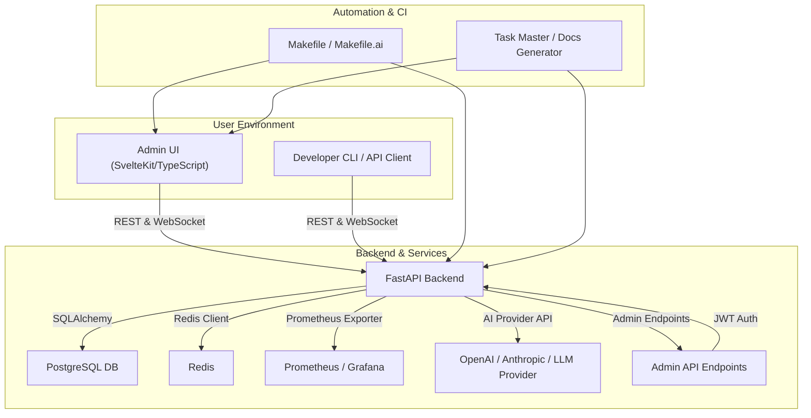

# System Architecture Diagram

This diagram shows the high-level architecture of the MCP Chat Client project, including user interfaces, backend services, data stores, AI providers, and automation components.

