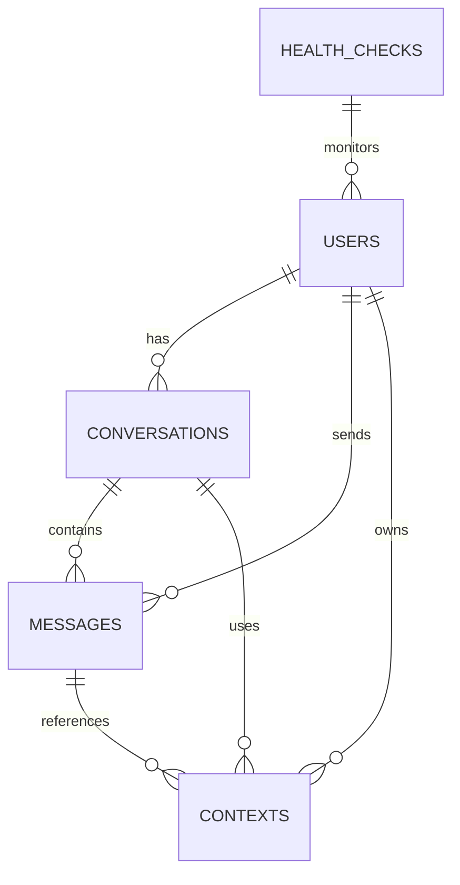

# Database Schema Documentation

This document describes the main database schema for the MCP Chat Client backend. It includes an entity-relationship (ER) diagram, table summaries, and references to the codebase for models and migrations.

---

## 📊 Entity-Relationship Diagram


```

---

## 🗂️ Table Summaries

| Table           | Key Columns                | Description                                      |
|-----------------|---------------------------|--------------------------------------------------|
| users           | id, email, password_hash  | Registered users/admins                          |
| conversations   | id, user_id, created_at   | Chat sessions between users and the system        |
| messages        | id, conversation_id, user_id, content, created_at | Individual chat messages         |
| contexts        | id, user_id, data, created_at | Contextual data for conversations/messages   |
| health_checks   | id, service_name, status, checked_at | Service health monitoring records         |

---

## 📝 Where to Find Models & Migrations
- **SQLAlchemy models:** `backend/app/models/`
- **Alembic migrations:** `backend/alembic/versions/`

---

## 🚧 Schema Changes & Migration Notes
- _Add notes here when schema changes or migrations are performed._ 