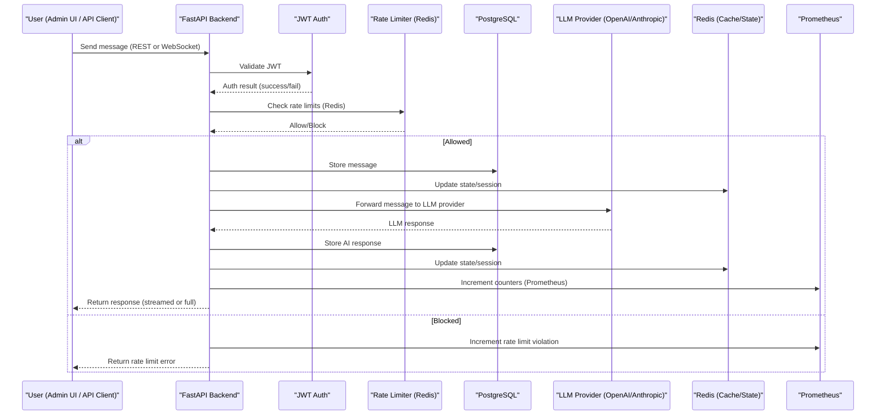
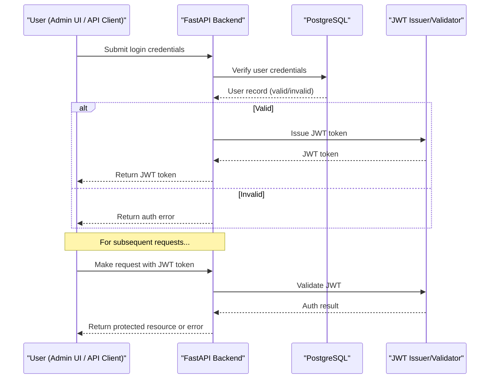
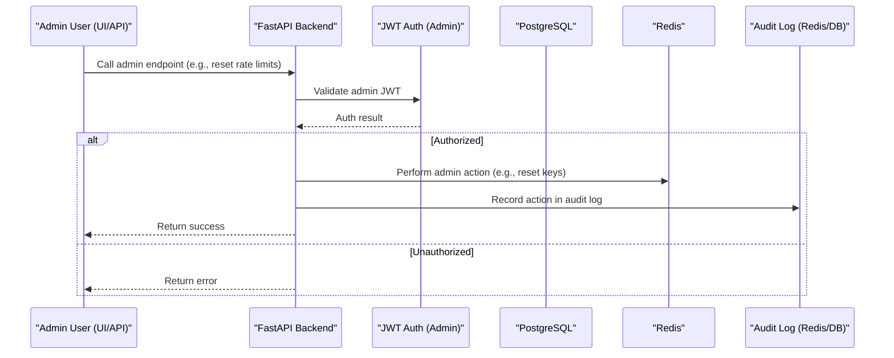

# Data Flow Diagrams

This document provides sequence diagrams for key workflows in the MCP Chat Client system.

---

## 1. User Message Flow (Chat)

This diagram shows the flow of a user message from the client through authentication, rate limiting, persistence, and AI/LLM processing.

---

## 2. Authentication Flow (Login & JWT)

This diagram shows the process of user login, JWT issuance, and validation for protected endpoints.

---

## 3. Admin Action Flow (Admin Endpoint, Audit Log)

This diagram shows an admin performing a privileged action, with authentication, effect, and audit logging.

