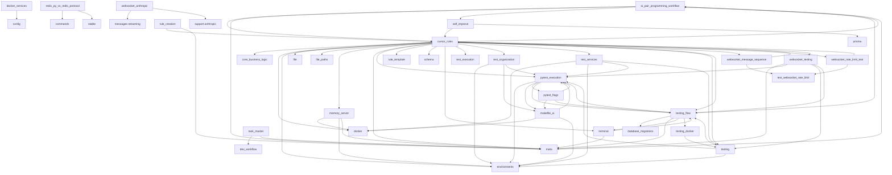

```mermaid
graph TD

  ai_pair_programming_workflow --> cursor_rules
  ai_pair_programming_workflow --> meta
  ai_pair_programming_workflow --> self_improve
  ai_pair_programming_workflow --> testing_flow
  cursor_rules --> ai_pair_programming_workflow
  cursor_rules --> core_business_logic
  cursor_rules --> docker
  cursor_rules --> environments
  cursor_rules --> file
  cursor_rules --> file_paths
  cursor_rules --> memory_server
  cursor_rules --> meta
  cursor_rules --> pytest_execution
  cursor_rules --> rule_template
  cursor_rules --> schema
  cursor_rules --> terminal
  cursor_rules --> test_execution
  cursor_rules --> test_organization
  cursor_rules --> test_services
  cursor_rules --> testing
  cursor_rules --> testing_flow
  cursor_rules --> websocket_message_sequence
  cursor_rules --> websocket_rate_limit_test
  cursor_rules --> websocket_testing
  docker_services --> config
  makefile_ai --> docker
  makefile_ai --> environments
  makefile_ai --> pytest_execution
  memory_server --> docker
  memory_server --> environments
  memory_server --> meta
  meta --> ai_pair_programming_workflow
  pytest_execution --> environments
  pytest_execution --> makefile_ai
  pytest_execution --> pytest_flags
  pytest_execution --> testing_flow
  pytest_flags --> makefile_ai
  pytest_flags --> pytest_execution
  pytest_flags --> testing_flow
  redis_py_vs_redis_protocol --> commands
  redis_py_vs_redis_protocol --> stable
  rule_creation --> cursor_rules
  rule_creation --> meta
  self_improve --> cursor_rules
  self_improve --> prisma
  task_master --> dev_workflow
  task_master --> meta
  terminal --> meta
  terminal --> testing_flow
  test_organization --> environments
  test_organization --> makefile_ai
  test_organization --> pytest_execution
  test_services --> docker
  test_services --> environments
  test_services --> pytest_execution
  test_services --> testing
  testing --> environments
  testing --> pytest_execution
  testing --> testing_flow
  testing_docker --> testing
  testing_flow --> database_migrations
  testing_flow --> meta
  testing_flow --> pytest_execution
  testing_flow --> terminal
  testing_flow --> testing_docker
  websocket_anthropic --> messages-streaming
  websocket_anthropic --> support.anthropic
  websocket_message_sequence --> cursor_rules
  websocket_message_sequence --> test_websocket_rate_limit
  websocket_rate_limit_test --> cursor_rules
  websocket_rate_limit_test --> test_websocket_rate_limit
  websocket_testing --> meta
  websocket_testing --> pytest_execution
  websocket_testing --> testing
  websocket_testing --> testing_flow
```
